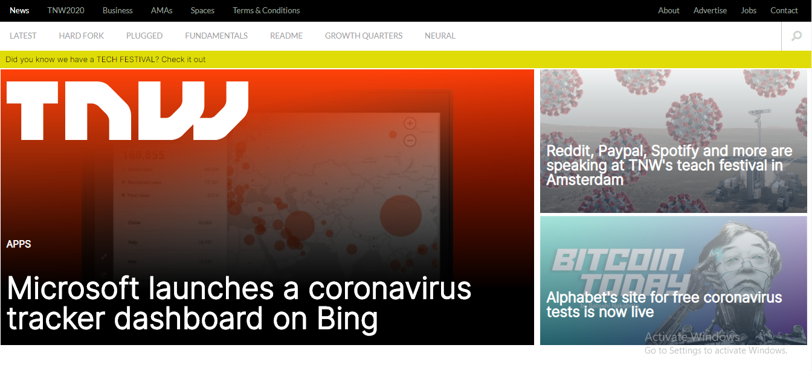
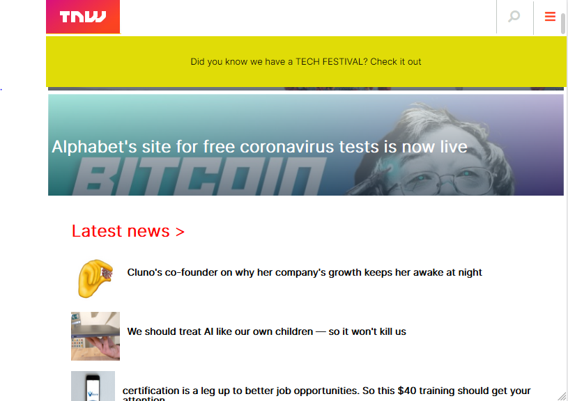

# Responsive Design

> This project consists of building a responsive web page that can be viewed on different screen sizes and devices

Screenshot of Page

 
 

> To achieve this output we had to first layout the web page and then use media queries to add styles specific to different screen and device sizes.

## Built With

- Html,
- Css

[Live Demo Link](https://rawcdn.githack.com/frankopkusianwar/Responsive-Design/545d2817955d15cbb5dc07b3fd68f739cca16f01/index.html)

## Authors

👤 **Osong Agberndifor**

- Github: [Osong Agberndifor](https://github.com/OA7)
- Twitter: [Osong Agberndifor](https://twitter.com/Osong17)
- Linkedin: [Osong Agberndifor](https://linkedin.com/osong-agberndifor)

👤 **Okiror Frank**

- Github: [Okiror Frank](https://github.com/frankopkusianwar)
- Twitter: [Okiror Frank](https://twitter.com/franko0781)
- Linkedin: [Okiror Frank](https://linkedin.com/in/frank-okiror-250076b5)

## 🤝 Contributing

Contributions, issues and feature requests are welcome!

Feel free to check the [issues page](https://github.com/frankopkusianwar/Responsive-Design/issues).

## Show your support

Give a ⭐️ if you like this project!
